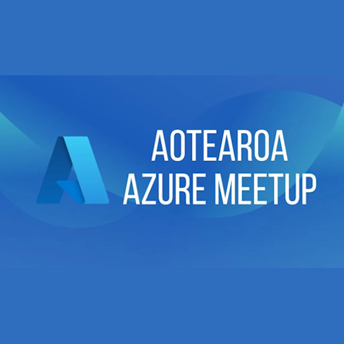

# Global Azure Auckland - Aotearoa Azure Meetup

We're excited to be hosting an event at the **[Aotearoa Azure Meetup](https://www.meetup.com/auckland-azure-usergroup/)** in Auckland!

Join us for a **hybrid lunch session** where we'll dive into Azure and explore topics like AI, security, identity, developer technologies, DevOps, and more.

This is also a fantastic opportunity to network with MVPs and industry experts in the Azure space.

Sessions will be delivered to our live audience and streamed via Microsoft Teams.

## Call for Speakers

The [Call for Speakers is open](https://sessionize.com/global-azure-auckland-2025). Don't wait to the last day to submit your sessions!!!

## Key information

* 📅Thursday, May 8th, 2025
* 🏠Hybrid at Microsoft House, Level 5/22 Viaduct Harbour Avenue, Auckland
* 🎫Registration will be available closer to the event date on [Meetup](https://www.meetup.com/auckland-azure-usergroup/).
* 🎙️Call for speakers - [https://sessionize.com/global-azure-auckland-2025](https://sessionize.com/global-azure-auckland-2025)
* 💶Sponsors - We are looking for sponsors. Reach out to any of the [organizers](#organizers)

## Organizers

If you have any questions, feedback or thoughts, please reach out to the community organisers:

* Ahmed Muhi [Microsoft MVP](https://mvp.microsoft.com/en-US/MVP/profile/c21c4142-bd98-44cf-ad5a-7ac539f0e61b)
* Luke Murray [Microsoft MVP](https://mvp.microsoft.com/en-US/MVP/profile/d34dd21d-04c6-ec11-a7b5-0022482d3c49)
* Marcel Medina [Microsoft MVP](https://mvp.microsoft.com/en-US/mvp/profile/67ea0e57-1e9e-ed11-83ff-000d3a5600fa)
* Rory Braybrook [Microsoft MVP](https://mvp.microsoft.com/en-US/mvp/profile/701af859-76af-e911-a98e-000d3a137a43)
