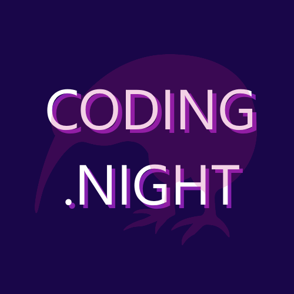

# Global Azure Auckland - Coding Night NZ

We're excited to be co-hosting this event at **[Coding Night NZ](https://www.meetup.com/coding-night-nz/)**!

Join us for online sessions where we'll dive into Azure and explore topics like AI, security, identity, developer technologies, DevOps, and more.

This is also a fantastic opportunity to connect with MVPs and industry experts in the Azure space.

Sessions will be delivered live and streamed on the Coding Night NZ YouTube channel.

## Call for Speakers

The [Call for Speakers is open](https://sessionize.com/global-azure-auckland-2025). Don't wait to the last day to submit your sessions!!!

## Key information

* 📅Saturday, May 10th, 2025 
* 🌐Online on Coding Night NZ YouTube channel
* 🎫Registration will be available closer to the event date on [Meetup](https://www.meetup.com/coding-night-nz/).
* 🎙️Call for speakers - [https://sessionize.com/global-azure-auckland-2025](https://sessionize.com/global-azure-auckland-2025)
* 💶Sponsors - We are looking for sponsors. Reach out to any of the [organizers](#organizers)

## Organizers

If you have any questions, feedback or thoughts, please reach out to the community organisers:

* Ahmed Muhi [Microsoft MVP](https://mvp.microsoft.com/en-US/MVP/profile/c21c4142-bd98-44cf-ad5a-7ac539f0e61b)
* Luke Murray [Microsoft MVP](https://mvp.microsoft.com/en-US/MVP/profile/d34dd21d-04c6-ec11-a7b5-0022482d3c49)
* Marcel Medina [Microsoft MVP](https://mvp.microsoft.com/en-US/mvp/profile/67ea0e57-1e9e-ed11-83ff-000d3a5600fa)
* Rory Braybrook [Microsoft MVP](https://mvp.microsoft.com/en-US/mvp/profile/701af859-76af-e911-a98e-000d3a137a43)